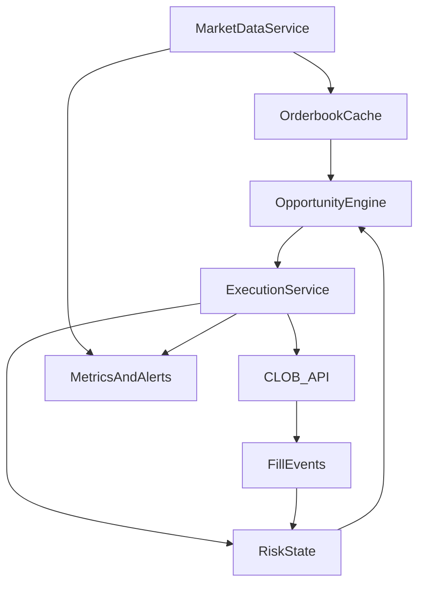

# Polymarket Arbitrage Sniping Bot Plan

## Goals

- Build a low-latency bot architecture for detecting and executing risk-bounded arbitrage or mispricing opportunities on Polymarket’s CLOB.
- Use official APIs (REST + WebSocket) with robust controls: fees, latency, inventory, and compliance.

## Key Inputs From Docs

- CLOB client supports public market data and order books, plus order management via authenticated methods.
- Real-time data available via WebSocket market/user channels.
- Order book summaries and best prices via REST endpoints for initial snapshot and backfills.

## Strategy Design (High-Level)

- **Data Edge**: Subscribe to WebSocket market channels for live order book updates and trades; bootstrap with REST snapshots to avoid gaps.
- **Arb Detection**:
  - Identify cross-market inconsistencies (same underlying event across different markets or closely related outcomes).
  - Detect internal inconsistencies inside a market (e.g., binary complementary tokens that imply arbitrage after fees).
  - Score opportunities by expected edge: price delta − fees − slippage − latency buffer.
- **Execution Logic**:
  - Use fast, size-aware limit orders with FOK/FAK where supported for “sniping” to avoid partial fills.
  - Include cancel/replace logic and a “stale book” detector (reject if snapshot hash/time is too old).
- **Risk Controls**:
  - Per-market and global exposure caps; max order size based on top-of-book depth.
  - Fee-aware profitability threshold; inventory limits per outcome.
  - Kill-switch for anomalous latency or repeated rejections.

## Architecture (Node.js)

- **Market Data Service**: WebSocket consumer + REST snapshot fetcher; maintains local order books.
- **Opportunity Engine**: scans candidate markets/outcomes; computes net edge and executable size.
- **Execution Service**: authenticated client for order placement, cancellations, and fill reconciliation.
- **Risk & State**: maintains positions, available balances, and open orders.
- **Monitoring**: metrics for latency, fill rate, edge capture, and error rates; alerting on anomalies.

## Mermaid Overview

## Implementation Steps

1. Set up Polymarket CLOB client in Node.js and verify public methods (health check, markets, order books).
2. Implement WebSocket market channel subscriber with reconnection and snapshot synchronization.
3. Build in-memory order book cache keyed by token ID; support best bid/ask and depth.
4. Define arbitrage detectors (binary complements + cross-market equivalents) with fee/slippage model.
5. Implement execution primitives (place, cancel, replace) using authenticated client; integrate FOK/FAK logic where supported.
6. Add risk guardrails, inventory accounting, and kill-switch triggers.
7. Add telemetry and paper-trading mode for dry runs before enabling live trading.

## Validation Plan

- Backtest with recent order book snapshots (paper simulation) and compare expected vs actual fills.
- Shadow mode in real time: detect opportunities without trading to estimate hit rate.
- Gradually enable trading with strict caps and observe metrics.

## Open Questions

- None (proceed with official API, Node.js stack).